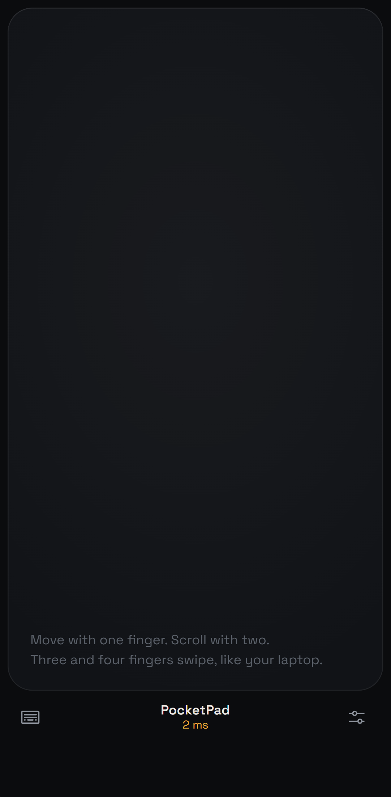
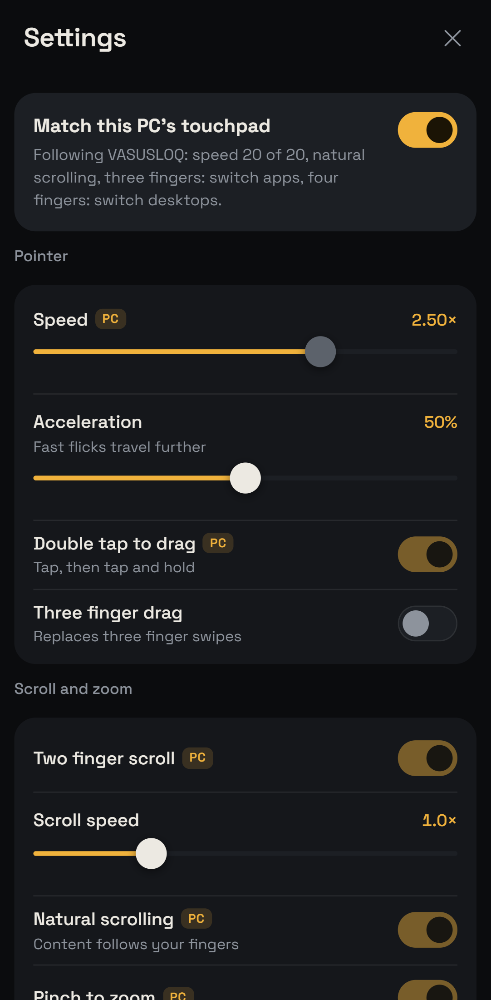
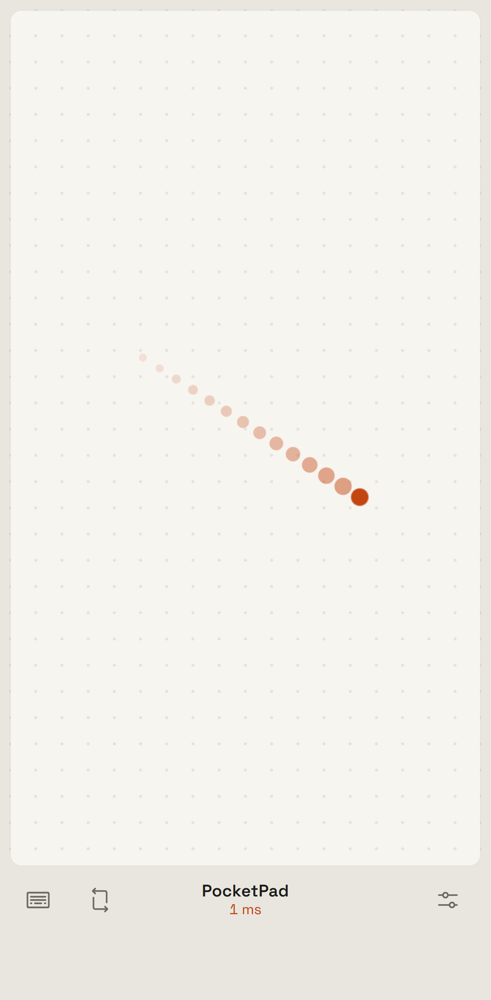
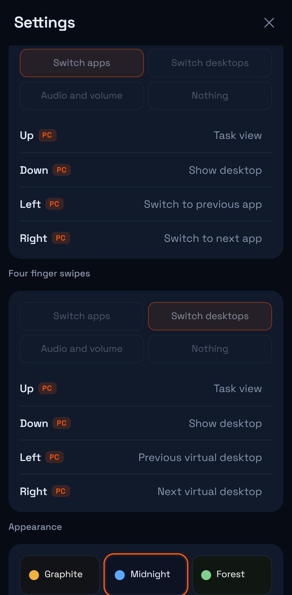

# PocketPad

Use your phone as a Windows precision-style trackpad. Nothing to install on the
phone: a small host runs on the laptop, the phone opens a web page, and every
gesture you know from a Windows touchpad works, using the settings your PC
already has.

<p>
  
  
  
  
</p>

```
phone browser  --Wi-Fi / hotspot / USB-->  PocketPad host (Windows)  --SendInput-->  cursor
  gestures, look and feel                   smoothing, validation, injection
```

## Install

Pick one.

**Just the exe.** Download `PocketPad.exe` from the
[latest release](https://github.com/vasu-devs/PocketPad/releases/latest) and run
it. Windows SmartScreen may ask once because the file is unsigned.

**pipx or pip** (Python 3.10+):

```
pipx install git+https://github.com/vasu-devs/PocketPad
pocketpad
```

**From a clone**: double-click `PocketPad.bat`, or `pip install -e .` and run `pocketpad`.

## Use

1. Run the host. It prints a URL and a QR code. When Windows asks, allow
   Python or PocketPad on **private** networks.
2. On the phone, on the same Wi-Fi, scan the QR. The URL carries a six-digit
   pairing key that changes every start (`--key 123456` fixes it).
3. Tap once for full screen. Android: "Add to Home screen" gives an icon that
   opens straight into the pad. iPhone: Share, then "Add to Home Screen".

### Connection modes

| Mode | Command | Typical latency | Notes |
|---|---|---|---|
| Wi-Fi via router | `pocketpad` | 5-30 ms | default |
| Laptop hotspot | `pocketpad --hotspot` | 2-8 ms | turns on Windows Mobile Hotspot, prints its name, password and the laptop's hotspot address; no router in the path |
| USB cable (Android) | `pocketpad --usb` | under 1 ms | downloads Google's platform-tools on first use; needs USB debugging on the phone; the phone opens a `127.0.0.1` address |

Other flags: `--port`, `--bind`, `--no-smoothing`, `--keep-mouse-accel`, `--dry-run`.

## Gestures

| Fingers | Gesture | What happens |
|---|---|---|
| 1 | move | pointer, with a speed and acceleration curve |
| 1 | tap | left click |
| 1 | tap, then tap and hold | drag |
| 1 | double tap | double click |
| 1 | drag in the right-edge lane | scroll; flick to coast |
| 2 | tap | right click |
| 2 | slide | smooth scroll, natural direction |
| 2 | pinch | zoom (Ctrl + wheel) |
| 3 | tap | your Windows setting (default: search) |
| 3 | swipe up / down | Task view / Show desktop |
| 3 | swipe left / right | the app switcher opens and follows your hand; lift to land on an app |
| 4 | tap | your Windows setting (default: notification center) |
| 4 | swipe up / down | Task view / Show desktop |
| 4 | swipe left / right | switch virtual desktops (repeats as you keep sliding) |

The dock has three buttons: keyboard (type on the PC from the phone, a real
on/off toggle), rotate (cycles orientation modes), and settings.

## It follows your PC

On connect the host reads your Windows Precision Touchpad preferences (cursor
speed, scroll direction, taps, tap-and-drag, pinch, three and four finger swipe
and tap choices) and the phone mirrors them. Settings shows "Match this PC's
touchpad" at the top with a summary; turn it off to tune the phone on its own.
Anyone who runs the host on their own PC gets their own feel automatically.

Two Windows mouse settings would otherwise distort injected motion, so the host
handles them: **Enhance pointer precision** is paused while the host runs and
restored on exit (live setting only, registry untouched; `--keep-mouse-accel`
opts out), and the **mouse pointer speed slider** multiplier is cancelled so the
phone's speed means the same thing on every PC.

## Look and feel

Settings > Appearance: six themes (Graphite, Midnight, Forest, Rose, Pitch black,
Paper), a free accent colour, pad surface (plain, grid, dots, carbon), touch
effect (rings, glow, comet, off), round or sharp corners, vibration strength.
Settings > Surface: orientation, scroll strip, on-screen mouse buttons, keep
screen on. Everything is stored on the phone.

Holding the phone sideways: the layout rotates with the phone. If rotation is
locked, use the rotate button; the app asks the browser to rotate and, if that
is refused, rotates the touch input instead so the cursor still follows your hand.

## How it works

```
pocketpad/
  main.py        CLI, LAN address discovery, QR banner, --usb / --hotspot
  server.py      aiohttp app: static files + /ws channel, pairing check, stuck-key release
  protocol.py    wire format (JSON + 9-byte binary motion frames), per-connection accumulators
  smoother.py    high-rate motion smoother thread
  sysprefs.py    reads Windows Precision Touchpad preferences from the registry
  mouseaccel.py  pauses "Enhance pointer precision", reads the pointer-speed multiplier
  netmodes.py    adb reverse (USB) and Windows Mobile Hotspot
  actions.py     named actions (Task view, volume, snap...) and `keys:` custom combos
  keys.py        virtual-key table, aliases, combo parser
  input_win.py   SendInput via ctypes (mouse, wheel, scan-code keys, Unicode text)
  injector.py    Injector interface + FakeInjector (tests, --dry-run)
  config.py      constants, error codes, HostConfig
  web/           the phone app: index.html, style.css, gestures.js, settings.js, app.js
tests/           pytest: protocol, keys/actions, smoother, prefs, HTTP + WebSocket
build_exe.py     PyInstaller one-file build
```

- The phone owns look-and-feel and gesture preferences (deferring to the PC's
  touchpad settings by default) and sends semantic events. The host is a dumb,
  validated injector.
- Motion goes out per touch sample as a 9-byte binary frame. The host's smoother
  spreads each sample evenly until the next one arrives, so Wi-Fi burstiness
  does not become cursor stutter. Sub-pixel remainders are carried, never dropped.
- Scroll emits small wheel deltas for smooth scrolling; "Whole notches only"
  batches to 120-unit notches for apps that ignore partial deltas.
- A dropped connection releases every held button and modifier.

## Security

- Pairing key required on the WebSocket; a wrong key is closed with code 4403
  before anything reaches the injector.
- Every message is size-limited, type-checked and clamped. Unknown actions and
  key names are rejected. Text is capped per message.
- Traffic is plain HTTP on your LAN. Anyone on the same network who has the key
  can control the mouse, so treat the key like a password and do not run the
  host on public Wi-Fi. `--bind 192.168.1.36` limits it to one interface.

## Development

```
pip install -e .[dev]
python -m pytest -q        # 33 tests
python build_exe.py        # dist/PocketPad.exe
```

Gesture recognition was verified in an emulated Pixel 7 (Playwright + Chrome
DevTools touch events) for move, tap, two-finger tap, scroll, pinch, three and
four finger swipes, the live app switcher, double-tap drag, the scroll strip and
orientation rotation. `--dry-run` logs injected events without moving anything.
CI runs the tests and builds the exe on every push; a `v*` tag publishes a release.

## Known limits

- This is input synthesis, not a real Precision Touchpad. Windows does not list
  PocketPad under Touchpad settings. A virtual HID driver (UMDF VHF, signed)
  would be the way to change that.
- Windows only writes a gesture preference to the registry once it has been
  changed from default, so the custom per-direction numbering is best effort
  until verified against a PC that has customised them.
- Android Chrome gives fullscreen; iOS Safari only via Add to Home Screen.

MIT licence.
